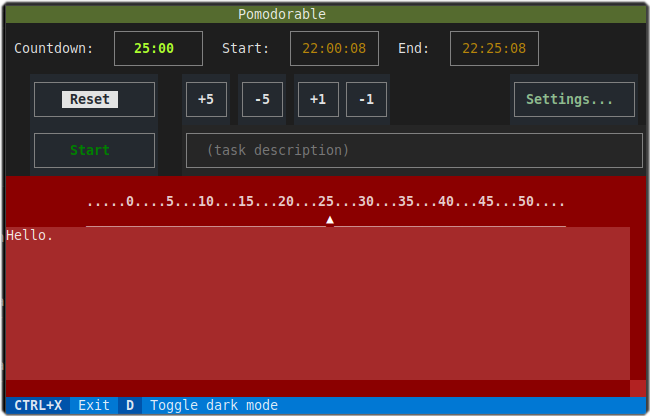

# pomodorable

A **pomodoro timer** built using Textual.

> Development work in progress.

## Screenshot

## Reference

- [Pomodoro Technique - Wikipedia](https://en.wikipedia.org/wiki/Pomodoro_Technique)

### Packages used

- [Textual](https://textual.textualize.io/) - Textual User Interface framework
- [Click](https://palletsprojects.com/p/click/) - command-line options
- [platformdirs](https://github.com/platformdirs/platformdirs) - common directories on different platforms
- [plyer](https://pypi.org/project/plyer/) - system notifications
- [python-dotenv](https://pypi.org/project/python-dotenv/) - override default settings during development
- [tomlkit](https://pypi.org/project/tomlkit/) - store configuration as TOML

### Project tools

- [Hatch](https://hatch.pypa.io/latest/) - Python project manager (environments, packaging, and more)
- [Ruff](https://docs.astral.sh/ruff/) - linter and code formatter (integrated with Hatch)
- [pytest](https://docs.pytest.org/en/stable/) - testing framework
- [Just](https://github.com/casey/just) - command runner
