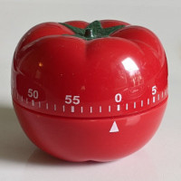
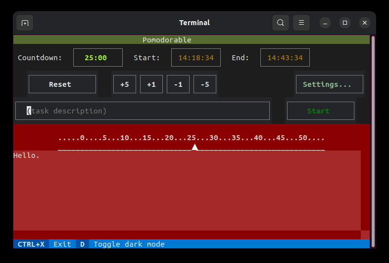

# pomodorable

<!--  -->
<p>
<a href="https://github.com/wmelvin/pomodorable/raw/main/readme_images/pomodorable.png">
</a></p>

---

A [pomodoro timer](https://en.wikipedia.org/wiki/Pomodoro_Technique) built using [Textual](https://textual.textualize.io/).


<!--  -->
<p>
<a href="https://github.com/wmelvin/pomodorable/raw/main/readme_images/pomororo-timer-200.jpg">
</a></p>

## Screenshots

<!--  -->
<p align="center">
<a href="https://github.com/wmelvin/pomodorable/raw/main/readme_images/app-1.gif">
</a></p>

## Installation

Pomodorable is available on PyPI and can be installed using [pip](https://github.com/pypa/pip). However, to avoid dependency conflicts, it is recommended to use **pipx** or **uv**. Follow the links below for more information on how to install and use these tools.

[pipx](https://github.com/pypa/pipx) installs Python applications into isolated environments and makes them available globally on the command line.

``` shell
pipx install pomodorable
```

[uv](https://github.com/astral-sh/uv) is a Python package and project manager that can also install Python applications so they are available on the command line.

``` shell
uv tool install pomodorable
```


## Using the Application

### Modes

1. **Ready**
    - Initial mode when the application starts.
    - Returned to when a session is *finished* or *stopped*.
2. **Running**
    - Entered when the *Start* button is pressed.
    - Returned to when *Extend* or *Resume* is chosen in *paused* mode.
3. **Paused**
    - Entered when the *Pause* button is pressed.
    - Ended by pressing *Extend*, *Resume* or *Stop*.

### Display and Inputs

#### Times Display

- **Countdown** display: Shows the time remaining in the current session.
- **Start Time** display: Shows the Start time of the current session. When a session is not *running* it shows the current time.
- **End Time** display: Shows the End time of the current session. When a session is not *running* it shows the current time plus the session length.

#### Settings Panel

- **Reset** button: Resets the *Countdown* to the configured session length (default setting is 25 minutes).
- **+5**, **+1**, **-1**, **-5** buttons: Increment or decrement the *Countdown* by minutes.
- **?** (About) button: Open the [About screen](#about-screen).
- **Settings** button: Open the [Settings screen](#settings-screen).

#### Task Panel

- **Task description** input box: A brief description of the task at hand (optional). Press the **down arrow** key to open a list of recently used descriptions to pick from.
- **Start** button: Starts the session. Countdown begins. Time displays show Start and End times for the running session.

#### Pause Panel - Running

- **Pause** button: Pause the running session.
- **Reason description** input box: Disabled when *running*.

#### Pause Panel - Paused

- **Pause** button: Disabled when *paused*.
- **Reason description** input box: Enter the reason for pausing (optional). Press the **down arrow** key to open a list of recently used descriptions to pick from.
- **Extend** button: Return to *running*. Add the paused duration to the end-time to complete the full session length time-on-task.
- **Resume** button: Return to *running*. Resume the session from the current time. The pause duration is subtracted from the countdown, reducing the session's time-on-task.
- **Stop** button: Finish the session now. Return to *ready* mode.

#### Timer Bar

- Mimics the markings on a classic pomodoro (tomato-shaped) kitchen timer.
- Shows the current countdown minute at the pointer.

#### Log Panel

- Shows messages from the application with a timestamp.

#### Footer

The footer line at the bottom shows *key bindings* for the application:

- **Down arrow** opens the list of *most recently used inputs* to pick from. This only works when the text input box (for *task description* or *pause reason*) has focus.
- **Ctrl**+**q** quits the application.

### About Screen

The *About* screen is a dialog box showing some information about the application.

- **Version** number of the application.
- **GitHub** button: Open the web browser and go to the source GitHub page.
- File locations:
    - **Data path** shows the directory where the application's data is stored. Output files are written to different locations as configured in the *Settings* screen.
    - **Configuration** shows the full path to the application's configuration file.
- **Close** button: Closes the dialog.

### Settings Screen

The *Settings* screen is where you configure the application. It has the following settings:

- **Session Minutes**: Initial *Countdown* setting on startup, finish, stop, or reset.
- **Do system notification**: Turn the system notification (toast) on or off.
- **Play sound file**: To play a sound as an end-of-session notification, enter the full path to a WAV file. The entire audio will be played, and there is no control for volume or stopping playback, so a short audio clip lasting only a few seconds works best.
- **Running CSV Folder**: Folder to which the file is written. The folder must already exist.
- **Running CSV File Name**: Name to use for the output file (default is `pomodorable-sessions.csv`).
- **Daily CSV Folder**: Folder to which the file is written. The folder must already exist.
- **Filter CSV Output**: Exclude selected actions from the CSV output files (see *Filters* below).
- **Daily Markdown Folder**: Folder to which the file is written. The folder must already exist.
- **Daily Markdown Heading**: The Markdown [heading](https://docs.github.com/en/get-started/writing-on-github/getting-started-with-writing-and-formatting-on-github/basic-writing-and-formatting-syntax#headings) to insert before the individual sessions. The heading can be any heading level (`# Heading-text` or `### Heading-text` for example).
- **Daily Markdown Append-only**: When enabled, the file must already exist. This is for the case where the file is initially created by another application (such as a Daily Note file created by Obsidian).
- **Filter Markdown Output**: Exclude selected actions from the Markdown output files (see *Filters* below).
- **Log Retention Days**: Number of daily log files to keep. This applies to the application's operational logs, not the session data.

**Filters** for CSV and Markdown output:

| Settings screen | CLI: `--filters=` | Description |
| --- | --- | --- |
| Finish | F | Exclude *Finish* actions. |
| Pause (all) | P | Exclude all *Pause* actions. |
| Pause (w/o Reason) | R | Exclude *Pause* actions with no *reason* noted. |
| Stop | X | Exclude *Stop* actions. |

## Outputs

### Daily and Running CSV

The **Daily CSV** output is for a single day. The folder it is written to can be configured in the *Settings* screen. The name of the file is the current date as *yyyy*-*mm*-*dd*.csv (`2024-04-30.csv`, for example).

The **Running CSV** output spans multiple days (*running* vs *daily*). Both the folder, and file name, are configured in the *Settings* screen.

The following columns are in the CSV output files:

- **date**: Date of the action.
- **act**: Action code (see below). When exported via the `--export-csv` CLI option, *Start* actions will instead have the *session number* (daily sequence).
- **time**: Time of the action.
- **task**: Description of the task for *Start* actions, otherwise empty.
- **message**: Message associated with the action. Varies depending on the action.
- **notes**: Note associated with the action. Varies depending on the action.

Action codes:

- **S** - Start
- **E** - Extend (after Pause)
- **R** - Resume (after Pause)
- **F** - Finished session
- **X** - Stopped session

Note: The format of the CSV output files is based on the layout of a spreadsheet the author uses to track *pomodoro sessions* (among other things). It is designed for easy copy and paste into that spreadsheet. It's likely not the layout someone else would choose.

### Daily Markdown

The *Daily Markdown* output is designed to insert *pomodoro sessions* into a [Daily Notes](https://help.obsidian.md/Plugins/Daily+notes) file in [Obisdian](https://obsidian.md/).

If the *Daily Markdown Append-only* setting is enabled, the Daily Note file (expects `YYYY-MM-DD.md`) must already exist. This is for the case where a [template](https://help.obsidian.md/Plugins/Templates) is used for Daily Note files and you want that template to always be used to create the file. If sessions are completed before the file is created they will be included the first time a session finishes and the Daily Note file exists.

## Data

### Configuration File

The configuration file is `pomodorable-config.toml` and is stored in a folder named `pomodorable` under the *user config* folder for the operating system. Configuration settings are managed in the *Settings* screen. You should not need to directly edit this file.

### Data File

The main data file is `pomodorable-data.csv` and is stored in a folder named `pomodorable` under the *user data* folder for the operating system.

Each **action** (or *event*) recorded by the application is written to this file.

The columns in the CSV file are:

- **version**: The version of the CSV format.
- **date**: The date of the action.
- **time**: The time of the action.
- **action**: The *name* of the action.
- **message**: A message associated with the action.
- **duration**: The duration of the action.
- **notes**: Any notes associated with the action.

This file is not intended to be used directly (though being CSV format, that is easy to do). There are several output files that provide a log of pomodoro sessions for the user.

### Log Files

Log files are also written to the `pomodorable` folder under the system's *user data* folder.
Each log file is named with the current date.
The number of files to keep is configured in the *Settings* screen.

---

## Command-Line Usage

``` console

Usage: pomodorable [OPTIONS]

  Handle command-line options or run the Textual User Interface.

Options:
  --version           Show the version and exit.

  --csv-date TEXT     Export a Daily CSV file for a given date (provide the
                      date as YYYY-MM-DD or YY-MM-DD). If a 'Daily CSV Folder'
                      is not configured, then you must provide the --export-
                      path option as well. Existing files are not overwritten.
                      Exits when finished.

  --md-date TEXT      Export a Daily Markdown file for a given date (provide
                      the date as YYYY-MM-DD or YY-MM-DD). If a 'Daily
                      Markdown Folder' is not configured, then you must
                      provide the --export-path option as well. Existing files
                      are not overwritten. Exits when finished.

  --end-date TEXT     Export a range of sessions from the start date to the
                      end date (provide the dates as YYYY-MM-DD or YY-MM-DD).
                      This option is only valid with the --csv-date or --md-
                      date option.

  --timesheet         Export in Time Sheet format with one row per session.
                      This option is only valid with the --csv-date option.
                      The --end-date option can be used to export a range of
                      dates.

  --export-path TEXT  Path to export a Daily CSV or Markdown file. This option
                      is required if a 'Daily CSV Folder' or 'Daily Markdown
                      Folder' is not configured, or you want the files written
                      to a different location.

  --filters TEXT      Filter specified actions from exported CSV data. The
                      filter is specified as a string with no spaces, where
                      each character represents a type of action to exclude.
                      The characters are: F (Finish), P (Pause - all), R
                      (pause w/o Reason), and X (Stop).

  --ctrl-s            Enable [Ctrl]+[s] for saving SVG screenshots in the app.
                      Screenshots are saved to the Desktop.

  --ctrl-t            Enable [Ctrl]+[t] to run manual testing functions.

  -h, --help          Show this message and exit.

```

---

## Reference

- [Pomodoro Technique - Wikipedia](https://en.wikipedia.org/wiki/Pomodoro_Technique)
- [Python Packaging User Guide](https://packaging.python.org/en/latest/)

See also: [devnotes.md](./devnotes.md)

### Packages Used

- [Textual](https://textual.textualize.io/) - Textual User Interface framework
- [Click](https://palletsprojects.com/p/click/) - command-line options
- [platformdirs](https://github.com/platformdirs/platformdirs#readme) - common directories on different platforms
- [plyer](https://pypi.org/project/plyer/) - system notifications
- [python-dotenv](https://pypi.org/project/python-dotenv/) - override default settings during development
- [tomlkit](https://pypi.org/project/tomlkit/) - store configuration as TOML
- [playsound3](https://github.com/sjmikler/playsound3) - cross-platform library to play sound files

### Project Tools

- [Hatch](https://hatch.pypa.io/latest/) - Python project manager (environments, packaging, and more)
  - [hatch-requirements-txt](https://github.com/repo-helper/hatch-requirements-txt) - Hatchling plugin to read dependencies from `requirements.txt`
- [pip-tools](https://pypi.org/project/pip-tools/) - pin dependencies using `pip-compile` to create `requirements.txt`
- [Ruff](https://docs.astral.sh/ruff/) - linter and code formatter (integrated with Hatch)
- [pytest](https://docs.pytest.org/en/stable/) - testing framework
- [Just](https://github.com/casey/just#readme) - command runner


#### Textual Development Tools

- Textual [Devtools](https://textual.textualize.io/guide/devtools/)
- [tcss-vscode-extension](https://github.com/Textualize/tcss-vscode-extension#readme): VS Code extension that enables syntax highlighting for Textual CSS files.
- [pytest-textual-snapshot](https://github.com/Textualize/pytest-textual-snapshot#readme): Snapshot testing for Textual applications

### More Textual Links

- [Tutorial](https://textual.textualize.io/tutorial/)
- [Widgets](https://textual.textualize.io/widget_gallery/)
- Styles: [Align](https://textual.textualize.io/styles/align/)
- Styles: [Content-align](https://textual.textualize.io/styles/content_align/)
- [Color](https://textual.textualize.io/api/color/)
